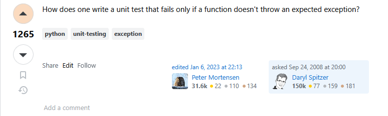
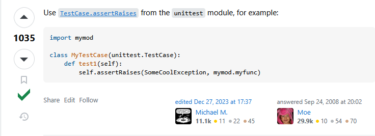
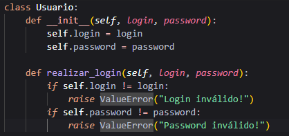
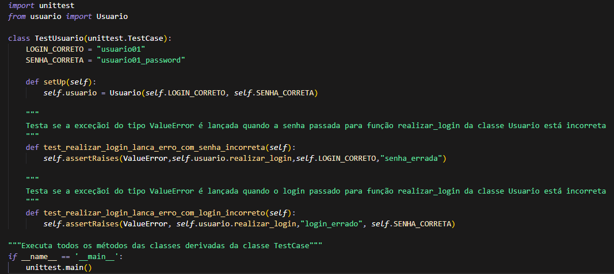

**Teste de Software - Atividade 1**

---

# Tutorial: How do you test that a Python function throws an exception?

**Pergunta selecionada:** [How do you test that a Python function throws an exception?](https://stackoverflow.com/questions/129507/how-do-you-test-that-a-python-function-throws-an-exception)

**Participantes da equipe:**

* Heitor Santos
* Itor Queiroz
* Lanna Silva
* Lavínia Santos
* Rômulo Santana

---

## 1. Descrição do problema
A questão no Stack Overflow aborda a forma adequada de testar funções em Python que lançam exceções. 

### Pergunta escolhida


*Figura 1: Questão do Stack Overflow*

### Resposta adotada


*Figura 2: Resposta adotada*

---

## 2. Solução utilizado

A solução aceita no Stack Overflow utiliza o módulo ``unittest``, especificamente a classe ``TestCase`` e seu método ``assertRaises``, que permite verificar se uma determinada exceção é lançada durante a execução de uma função. Vale a citação de que, apesar da questão enfatizar o uso de ```functions``` (referidas no texto como functions), a solução apresentada neste repositório utiliza de ```métodos```, ou seja, funções dentro de uma classe. Embora o que esteja sendo testado seja um método, o funcionamento do teste não mudaria caso fosse uma função comum: bastaria alterar o segundo parâmetro do método ```assertRaises``` para a função desejada e inserir seus respectivos parâmetros após o nome.

## 3. Exposição da solução utilizada:

Criação de uma classe para simular o problema com o nome ``Usuario`` no arquivo ``usuario.py``. Nessa classe é disposto um método chamado ``realizar_login`` que lança uma exceção do tipo ``ValueError`` caso o login ou a senha estejam incorretos. Abaixo uma imagem referente a classe ``Usuario``



*Figura 3: Classe Usuario*

Criação de uma classe de testes unitários no arquivo ``test_usuario.py`` para testar o método ``realizar_login`` da classe ``Usuario``. Nesse arquivo foram criados dois métodos ``test_realizar_login_lanca_erro_com_senha_incorreta`` e o ``test_realizar_login_lanca_erro_com_login_incorreto`` Abaixo uma imagem referente a classe ``TestUsuario``



*Figura 4: Classe TestUsuario*


### Resultado esperado:
* A exceção correta deve ser lançada pela função testada
* O teste deve falhar caso nenhuma exceção ou uma exceção incorreta seja lançada
* A verificação deve ser automatizada usando assertRaises do módulo unittest

---

## 4. Motivos da rejeição das demais respostas

As demais respostas não foram aceitas por apresentarem os seguintes problemas:

* Repetição de código;
* Exposição de duas formas de usar o método ``assertRaises``, o que acaba gerando duplicidade de código e uma complexidade desnecessária para quem necessita de apenas uma das formas de chamar;
* Use de try/catch aumenta a quantidade de linhas de código e inibe a intenção principal do problema da questão: testar se um método lança exceção;
* Resposta menos moderna e com uma menor flexibilidade;

---

## 5. Referências

* Stack Overflow - [Pergunta Original](https://stackoverflow.com/questions/129507/how-do-you-test-that-a-python-function-throws-an-exception)
* Documentação unittest: [Documentação do unittest](https://docs.python.org/3/library/unittest.html)
---

## Executando os testes

Para executar os testes, execute os passos abaixo

1. **Clone o repositório**  
   Use o comando abaixo para clonar o repositório:

   ```
   git clone https://github.com/Itor-Carlos/Teste_Software_2025_Queiroz_Itor.git
   ```

2. **Navegue para o diretório do projeto**  
   Abra um terminal de sua preferência na pasta do projeto.

3. **Execute o arquivo de teste**  
   Execute o script de teste com o comando abaixo:

   ```
   python test_usuario.py
   ```
